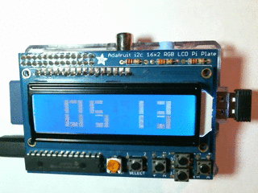

# Pi NTP WiFi Clock



A Raspberry Pi with a character display can be turned into an NTP (Network Time Protocol) clock. As long as the Pi has an Internet connection, the clock is very accurate because it periodically gets the correct date and time from NTP servers. The clock also automatically handles Daylight Saving Time changes.

## Parts ##

* Adafruit 16x2 LCD+Keypad Kit for Raspberry Pi https://www.adafruit.com/products/1115
* Raspberry Pi, any model that works with above
* Raspian Jessie includes support for the LCD
* USB WiFi adaptor

## Assemble LCD Pi Plate ##

Follow Adafruit's instructions and verify the LCD works.

## Install WiFi ##

Follow instructions at https://www.raspberrypi.org/documentation/configuration/wireless/ to install WiFi.

## Set timezone ##

Be sure to use set the timezone on the Pi.

```
sudo raspi-config
```

Select `Internationalisation Options` | `Change Timezone`.

## Enable I2C ##

The Pi communicates with the LCD display over the I2C serial protocol. I2C support must be enabled.


```
sudo raspi-config
```

Select `Advanced Options` | `I2C`.


## Install lcdproc ##

lcdproc drives the LCD and shows the current date and time.

```
sudo apt-get update
sudo apt-get upgrade
sudo apt-get install lcdproc
```

The files /etc/LCDd.conf and /etc/lcdproc.conf must be updated to work with the LCD. Both files are included in this repo.

```
cd
sudo apt-get install git
git clone https://github.com/bbx10/pi-ntp-clock
cd pi-ntp-clock
sudo cp LCDd.conf /etc
sudo cp lcdproc.conf /etc
sudo /etc/init.d/LCDd restart
sudo lcdproc
```

Run lcdproc whenever the Pi starts up. crontab is an easy way to do this.

```
crontab -e
```

Add the following line.

```
@reboot            sudo /usr/bin/lcdproc
```

## Troubleshooting ##

If the LCD does not work on older Pi's, look in LCDd.conf and change the
i2c device as shown below.

```
Device=/dev/i2c-0
```

to 

```
Device=/dev/i2c-1
```
